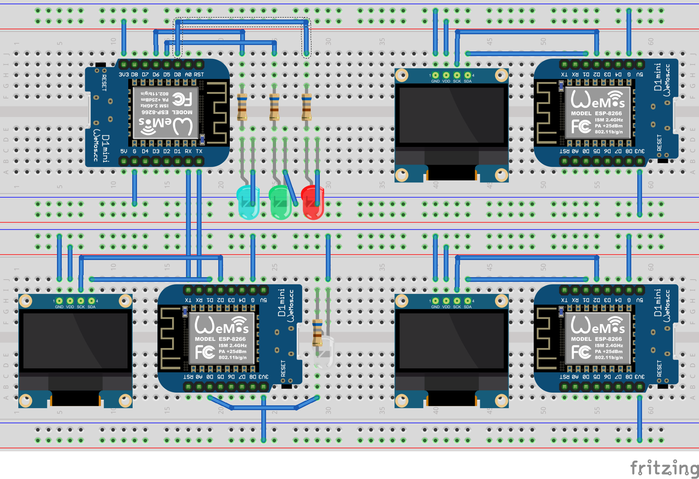

# TinyML Demo Using ESP8266 Microcontrollers Version 1.0

In this demo we will be attempting to create a model which will be converted to a Tensorflow lite model to run on a ESP8622 D1 Mini microcontroller.  The model will try to determine if the victim microcontroller is being attacked by being flooded with requests to put its LED light to 100%. The goal of this notebook is to learn more about using TinyML models and see how this can eventually be applied to a SCADA like enviroment.

# The Model

The model is contained within the Jupyter notebook Keras_TinyML_model

# Hardware

In the image above the 4 microcontrollers represent the normal requester (top-right), the attacker (bottom-right), the victim and "scada" device (bottom-left), and the microcontroller running the machine learning machine learning model (top-left).  The machine learning microcontroller is hooked up to the victim and communicates using UART.  The whole system runs on 3.3 volts and uses wifi for communications between the attacker/requester and the victim.

## The Victim

The system contains the following;
1. Wemos D1 mini microcontroller
2. SSD1306 .96" OLED Module
3. One White LED light
4. One 681 Ohm Resister

The device is a webserver and handles requests on what level to turn the light on.  The current levels it can use are 0%, 25%, 50%, 75%, and 100%.  This device represents a simple SCADA system in which 0% is off and 100% is full go which we use to represent the idea that if it is on too long it will damage the system so it the goal of the attacker is to get it to go to 100% for as long as possible.  When the device recives a request it will adjust the light level and send via UART the data to the ML microcontroller consiting of a concatenated number of the current LED light level, the previous LED light level, and how long the current level has been on in milliseconds (so 505060 means the current level is 50%, the previous level is 50% and it has been at 50% for 60ms).

## The Microcontroller Running the ML Model 

The system contains the following;
1. Wemos D1 mini microcontroller
2. Three LED lights (Blue, Red, Green)
3. Three 681 Ohm Resisters

The device will recive data from the victim device (using UART communications) consiting of a concatenated number of the current LED light level, the previous LED light level, and how long the current level has been on in milliseconds (so 505060 means the current level is 50%, the previous level is 50% and it has been at 50% for 60ms).  The number is then normalized by divding by 1000000 and then running the number through the model.  When the model is run the Blue LED will flash and the results are as follows; 

A Green LED flash = normal, no attack.

A Red LED flash = abnormal, attack detected

## The Requester

The requester machine is comprised of four parts;
1. Wemos D1 mini microcontroller
2. SSD1306 .96" OLED Module
3. Two 10k Ohm resisters
4. Two tactile push buttons

The requester works in a cycle of where it will make a request to the victim when ever a button is pushed up or down a level.  For example if the victim is at 0% and the up button is pushed it will go to 25%, and if the down button is pushed next it will go back down to 0%.

## The Attacker

The attacker machine is comprised of four parts;
1. Wemos D1 mini microcontroller
2. SSD1306 .96" OLED Module
3. One 10k Ohm resister
4. One tactile push button

The attacker will launch an attack once the button is pushed.  Once the attack starts the attacker will make 90 requests to the victim setting the light to 100% with about on request done every 1-2 seconds.
